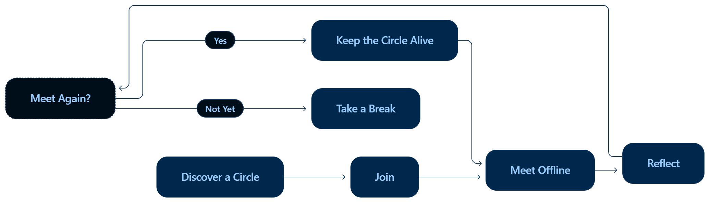
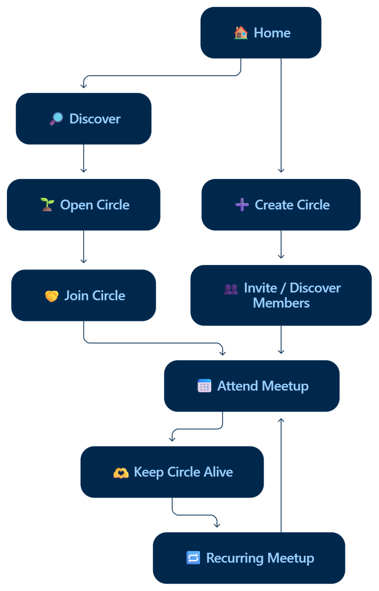

# 🌱 NEST

<p align="center">

### From "let's meet sometime" to "see you next Sunday."

**A hyperlocal platform that turns small offline meetups into recurring communities.**

<br/>


</p>

---

## 🏔️ HackerVilla Nainital — Edition 01

### Round 01 — Theme 05

> ## 🏙️ Smart Living & Connected Communities

**Challenge direction:**

> Reimagine how people live, travel, learn, work and interact through smart cities, mobility, IoT and safety.

### Our interpretation

NEST focuses on one overlooked part of connected living:

**How do we make people actually connect with the people around them — offline?**

Technology has made communication easier than ever, but meaningful local interaction can still be difficult.

NEST uses technology not to keep people online longer, but to help them **step outside and build small real-world communities.**

---

# 🧩 The Problem

We are more digitally connected than ever.

We have:

- Instagram followers
- WhatsApp groups
- College communities
- Online friends
- Event platforms
- Social media feeds

Yet making a simple offline plan can still look like:

```text
"Anyone free to study together this weekend?"

          ↓

        No replies

          ↓

     Plan postponed

          ↓

      Group becomes inactive

          ↓

        Try again...

## 🧩 How NEST Works

<p align="center">
  
</p>

## 🚀 NEST MVP Journey

<p align="center">
  
</p>